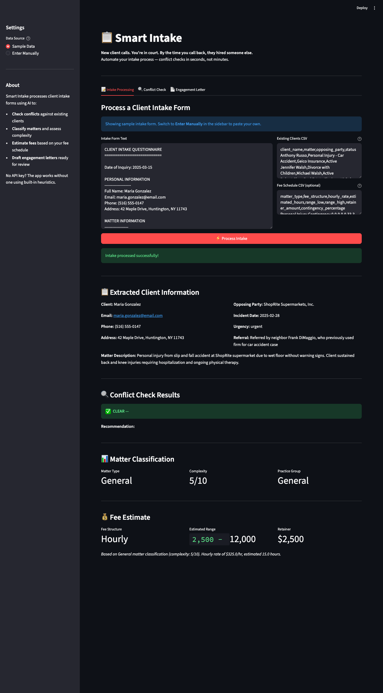
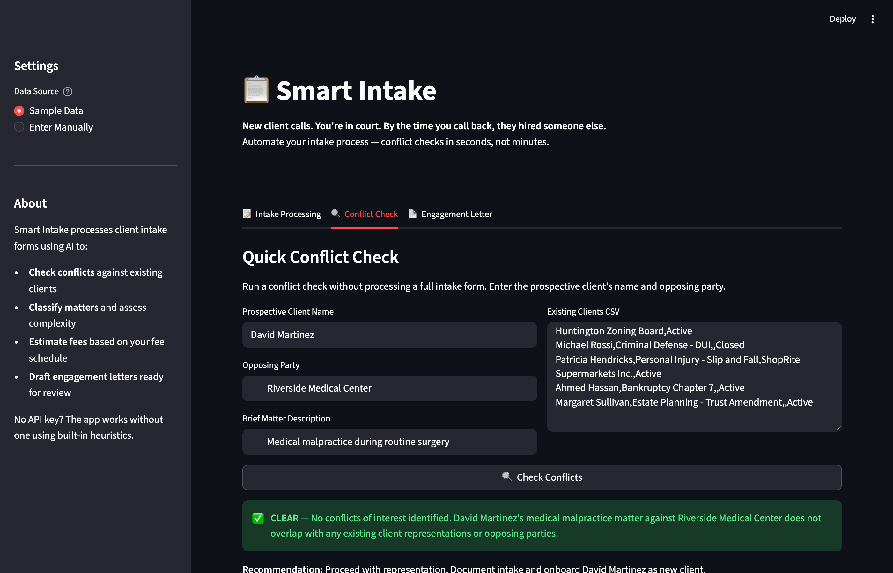

# Smart Intake

**New client calls. You're in court. By the time you call back, they hired someone else.**

The average small firm loses 30-40% of potential clients during intake -- not because the case is bad, but because the process is slow. Smart Intake automates conflict checks, matter classification, fee estimates, and engagement letter drafting so a new client goes from phone call to signed letter in minutes, not days.



---

## Real-World Example

We ran the sample intake through the tool -- a slip-and-fall plaintiff wanting to sue ShopRite. The firm already represents ShopRite in another matter. Here's what Smart Intake caught in **under 10 seconds:**

### Conflict Check



| Check | Result |
|-------|--------|
| **Conflicts Found** | 2 |
| **Severity** | 🔴 CONFLICT |
| **ShopRite match** | Firm represents ShopRite in active slip-and-fall defense -- direct adverse conflict |
| **Gonzalez match** | Thomas Gonzalez has a pending employment case against Suffolk County (client's employer) -- potential related-party issue |

A manual conflict check against 15 clients takes 15-30 minutes and relies on whoever is running it to catch the ShopRite connection. Smart Intake caught it instantly -- and flagged the Gonzalez surname overlap as a bonus.

### Matter Classification

| Field | Value |
|-------|-------|
| Matter Type | Personal Injury |
| Sub-category | Slip and Fall -- Premises Liability |
| Jurisdiction | Suffolk County, NY |
| Statute of Limitations | 3 years from incident |
| Complexity | 6/10 |

### Fee Estimate

| Field | Value |
|-------|-------|
| Fee Structure | Contingency |
| Rate | 33.3% |
| Retainer | None |

Pulled directly from the firm's own fee schedule CSV -- no guesswork.

---

## What It Does

- **Conflict checking** -- cross-references new client, opposing party, and related names against your existing client list. Catches direct conflicts, reverse conflicts, and surname overlaps
- **Intake form parsing** -- extracts structured data (name, contact, matter details, opposing party, urgency) from free-text intake questionnaires
- **Matter classification** -- categorizes by practice area, flags jurisdiction and statute of limitations, scores complexity 1-10
- **Fee estimation** -- matches matter type against your fee schedule CSV to suggest structure, range, and retainer
- **Engagement letter drafting** -- generates a ready-to-review draft based on all of the above

## Quick Start

```bash
# Clone and install
git clone https://github.com/rodaddy/smart-intake.git
cd smart-intake
uv sync

# Add your Anthropic API key (optional -- works without one)
cp .env.example .env
# Edit .env with your key

# Or use an OpenAI-compatible proxy (LiteLLM, Azure, etc.)
# LITELLM_API_BASE=http://your-proxy:4000/v1 LITELLM_API_KEY=sk-... uv run streamlit run app.py

# Run the app
uv run streamlit run app.py
```

No API key? The app ships with realistic sample data and works without one -- Claude adds smarter extraction and letter drafting, but conflict checks and classification run locally.

## Dashboard

Three tabs:

1. **Intake Processing** -- paste or load an intake form, get the full pipeline: extraction → conflict check → classification → fee estimate
2. **Conflict Check** -- quick standalone conflict check by name and opposing party
3. **Engagement Letter** -- generate a draft engagement letter from processed intake data

## Data Format

See [`sample_data/README.md`](sample_data/README.md) for CSV column specs. The tool expects:

| File | Purpose |
|------|---------|
| `intake_form.txt` | Free-text client intake questionnaire |
| `existing_clients.csv` | Your firm's client list for conflict checking |
| `fee_schedule.csv` | Fee structure by matter type |

## Tech Stack

| Component | Role |
|-----------|------|
| Streamlit | Web interface |
| Claude (Anthropic SDK) | AI extraction and letter drafting (direct) |
| OpenAI SDK | AI via OpenAI-compatible proxy (LiteLLM, etc.) |
| Pydantic | Structured data schemas |

Supports two AI backends: direct Anthropic API key, or any OpenAI-compatible proxy (LiteLLM, Azure, etc.) via `LITELLM_API_BASE` and `LITELLM_API_KEY` env vars. Falls back to built-in heuristics if neither is configured.

## Project Structure

```
smart-intake/
  app.py              # Streamlit application
  analyzer.py         # Core analysis engine
  models.py           # Pydantic schemas
  prompts.py          # Claude system prompts
  pyproject.toml      # Project config and dependencies
  sample_data/        # Sample intake form, client list, fee schedule
  docs/               # Screenshots
```

## Requirements

- Python 3.11+
- [uv](https://docs.astral.sh/uv/) package manager
- Anthropic API key (optional -- enhances extraction and letter drafting)

---

Built by **rTech Digital Consulting LLC**
